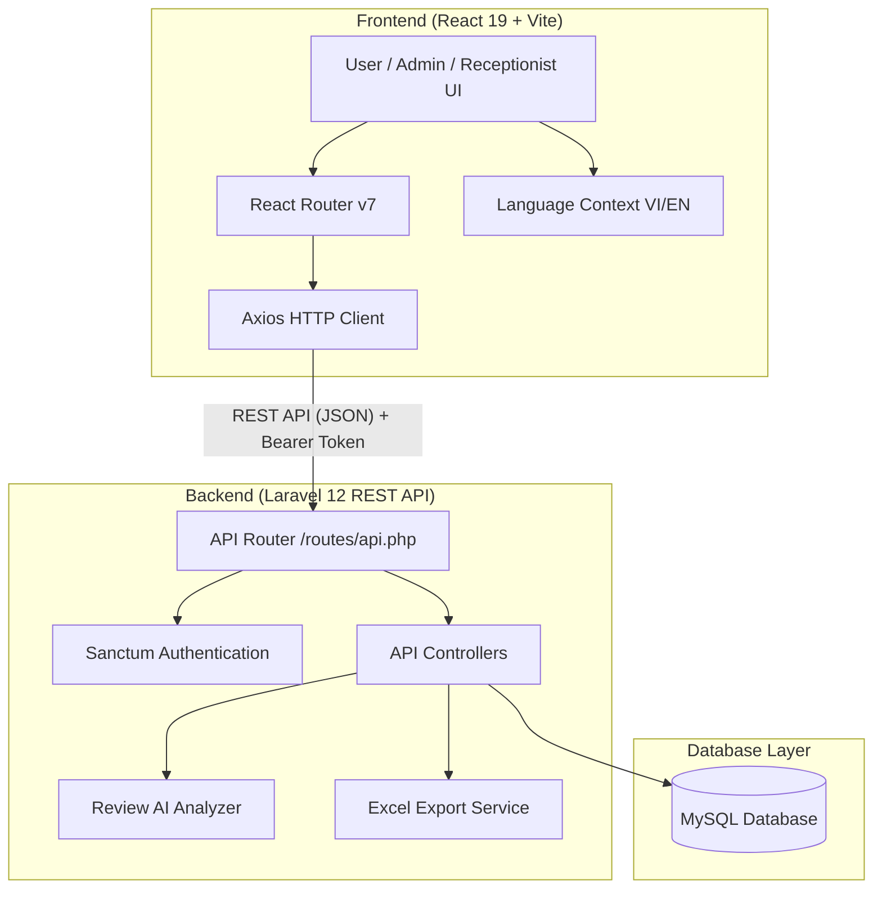

<div align="center">

# 🏨 La Maison DTN — Luxury Hotel Management & Booking System

### ✨ Nền tảng Đặt phòng & Quản lý Khách sạn 5★ Hiện đại — Phong cách Châu Âu

[](#)
[](#)
[](#)
[](#)
[](#)

[🌐 Live Demo](https://hotel-booking-umber-one.vercel.app/) • [📖 Frontend Docs](./frontend/README.md) • [⚙️ Backend API Docs](./backend/README.md)

</div>

---

## 📌 Tổng quan dự án (Project Overview)

**La Maison DTN** là giải pháp toàn diện cho nghiệp vụ khách sạn cao cấp, kết hợp giữa giao diện đặt phòng sang trọng phong cách nghỉ dưỡng 5 sao và hệ thống quản trị vận hành mạnh mẽ (Lễ tân - Admin - AI Analytics).

Dự án được xây dựng theo kiến trúc phân tách độc lập **Frontend (SPA React)** và **Backend (RESTful API Laravel)**, đảm bảo hiệu năng cao, bảo mật và khả năng mở rộng linh hoạt.

---

## 🌟 Tính năng nổi bật (Key Features)

### 1. 👤 Khách hàng (Customer Experience)
* **Giao diện đẳng cấp 5★**: Thiết kế chuẩn Luxury với hiệu ứng động mượt mà (Framer Motion).
* **Đa ngôn ngữ (i18n)**: Hỗ trợ chuyển đổi nhanh chóng giữa Tiếng Việt và Tiếng Anh (`LanguageContext`).
* **Sơ đồ phòng trực quan (Room Map)**: Xem sơ đồ phòng theo từng tầng (tầng 2 đến 9), kiểm tra trạng thái phòng trống/đang ở theo thời gian thực.
* **Quy trình đặt phòng tức thì**: Tìm kiếm, lọc loại phòng (Phòng Đơn, Phòng Đôi, Phòng Tổng Thống), chọn ngày check-in/out và đặt phòng nhanh.
* **Hồ sơ cá nhân & Lịch sử**: Quản lý thông tin cá nhân, cập nhật avatar, theo dõi lịch sử và trạng thái đơn đặt.
* **Đánh giá & Trải nghiệm khách hàng**: Gửi đánh giá, chấm điểm sao, tương tác like/reply.

### 2. 🛎️ Lễ tân (Receptionist Desk)
* **Quản lý Check-in / Check-out**: Tiếp nhận khách nhận phòng (`/nhan-phong`), thực hiện trả phòng (`/tra-phong`) và tính toán hóa đơn tự động.
* **Theo dõi đặt phòng thời gian thực**: Xem danh sách đặt phòng, lọc trạng thái, hủy đơn hoặc hoàn tất đơn.
* **Sơ đồ phòng tương tác**: Nắm bắt nhanh tình trạng phòng trên toàn khách sạn.

### 3. 👑 Quản trị viên (Admin Dashboard & AI Analytics)
* **Dashboard trực quan**: Biểu đồ thống kê doanh thu, tỷ lệ lấp đầy phòng, số lượng khách hàng và đơn đặt.
* **Quản lý phòng & bảng giá**: Điều chỉnh thông tin phòng, giá theo mùa và trạng thái bảo trì.
* **Quản lý tài khoản & phân quyền**: Quản lý tài khoản Admin, Nhân viên lễ tân, Khách hàng; khóa/kích hoạt tài khoản.
* **Phân tích AI & Xuất báo cáo (AI Analyzer)**: Ứng dụng AI phân tích cảm xúc đánh giá khách hàng và xuất báo cáo Excel (`/reviews/analyze-export`).

---

## 🧱 Công nghệ sử dụng (Tech Stack)

### 🔹 Frontend
* **Core**: React 19, Vite 7, React Router DOM v7
* **Styling**: TailwindCSS 3.4, PostCSS, Lucide React Icons
* **UI/UX & Components**: Framer Motion (`motion`), `@ant-design/x`, `clsx`, `tailwind-merge`
* **Networking & State**: Axios, Context API (`LanguageContext`)

### 🔹 Backend
* **Framework**: Laravel 12.x (PHP >= 8.2)
* **Authentication**: Laravel Sanctum (Token-based API Authentication)
* **Database**: MySQL 8.0 / MariaDB (Eloquent ORM, Migrations & Seeders)
* **Reporting**: Maatwebsite Excel (Xuất báo cáo phân tích AI)

---

## 🏛️ Kiến trúc hệ thống (System Architecture)



---

## 🚀 Hướng dẫn cài đặt & Khởi chạy dự án (Getting Started)

### ⚙️ Yêu cầu môi trường (Prerequisites)
* **Node.js**: `>= 18.x` & `npm`
* **PHP**: `>= 8.2` (Bật các extension: `pdo_mysql`, `mbstring`, `openssl`, `bcmath`, `fileinfo`, `gd`)
* **Composer**: `>= 2.2`
* **MySQL**: `>= 8.0` (XAMPP / Laragon / Docker / MySQL Server)
* **Git**

---

### 1️⃣ Khởi chạy Backend (Laravel)

1. Mở terminal và di chuyển vào thư mục `backend`:
   ```bash
   cd backend
   ```

2. Cài đặt các thư viện phụ thuộc:
   ```bash
   composer install
   ```

3. Tạo file cấu hình môi trường `.env`:
   ```bash
   # Windows (CMD / PowerShell):
   copy .env.example .env

   # Linux / macOS:
   cp .env.example .env
   ```

4. Tạo khóa ứng dụng (Application Key):
   ```bash
   php artisan key:generate
   ```

5. Cấu hình cơ sở dữ liệu trong file `.env`:
   ```env
   DB_CONNECTION=mysql
   DB_HOST=127.0.0.1
   DB_PORT=3306
   DB_DATABASE=hotel_booking
   DB_USERNAME=root
   DB_PASSWORD=
   ```
   *(Đảm bảo bạn đã tạo Database `hotel_booking` trong MySQL qua phpMyAdmin hoặc MySQL CLI)*.

6. Chạy Migration và Seed dữ liệu mẫu ban đầu:
   ```bash
   php artisan migrate --seed
   ```
   > 💡 *Nếu muốn làm mới toàn bộ CSDL:* `php artisan migrate:fresh --seed`

7. Tạo liên kết lưu trữ tệp (Storage symlink):
   ```bash
   php artisan storage:link
   ```

8. Khởi động Backend Server:
   ```bash
   php artisan serve
   ```
   Backend API sẽ hoạt động tại: **`http://127.0.0.1:8000`** (Base API: `http://127.0.0.1:8000/api`).

---

### 2️⃣ Khởi chạy Frontend (React + Vite)

1. Mở một terminal mới và di chuyển vào thư mục `frontend`:
   ```bash
   cd frontend
   ```

2. Cài đặt các gói phụ thuộc:
   ```bash
   npm install
   ```

3. Kiểm tra file cấu hình môi trường `.env` trong thư mục `frontend`:
   ```env
   VITE_API_URL=http://127.0.0.1:8000/api
   ```

4. Khởi chạy Development Server:
   ```bash
   npm run dev
   ```
   Truy cập giao diện tại: **`http://localhost:5173`**.

---

## 👥 Tài khoản thử nghiệm mặc định (Demo Credentials)

Hệ thống đã chuẩn bị sẵn các tài khoản demo sau khi bạn chạy `php artisan migrate --seed`:

| Vai trò (Role) | Email | Mật khẩu (Password) | Quyền hạn & Chức năng |
| :--- | :--- | :--- | :--- |
| **👑 Admin** | `admin@hotel.com` | `123456` | Quản trị toàn hệ thống, thống kê doanh thu, AI Analytics, quản lý tài khoản |
| **🛎️ Lễ tân (Receptionist)** | `nhanvien@hotel.com` | `123456` | Tiếp nhận Check-in, Check-out, quản lý phòng & đơn đặt |
| **👤 Khách hàng (Customer)** | `khachhang@gmail.com` | `123456` | Đặt phòng trực tuyến, theo dõi đơn đặt, cập nhật profile cá nhân, gửi review |

---

## 📁 Cấu trúc thư mục (Directory Structure)

```text
Hotel-Booking/
├── backend/                       # Source code Backend (Laravel 12 API)
│   ├── app/                       # Models, Controllers, Middleware, Services
│   │   └── Http/Controllers/Api/ # API Controllers (Auth, Phong, DatPhong, Review...)
│   ├── database/
│   │   ├── migrations/            # Cấu trúc bảng CSDL
│   │   └── seeders/               # Dữ liệu mẫu khởi tạo (DatabaseSeeder)
│   ├── routes/
│   │   └── api.php                # Định nghĩa toàn bộ API Endpoints
│   ├── .env.example               # Mẫu file biến môi trường backend
│   └── README.md                  # Hướng dẫn chi tiết Backend
│
├── frontend/                      # Source code Frontend (React 19 + Vite)
│   ├── src/
│   │   ├── components/            # UI components tái sử dụng (Header, Footer, Modals...)
│   │   ├── context/               # React Context (LanguageContext đa ngôn ngữ)
│   │   ├── locales/               # Bản dịch ngôn ngữ (vi.js, en.js)
│   │   ├── pages/                 # Các trang giao diện chính
│   │   │   ├── admin/             # HotelDashboard, AIAnalyzer
│   │   │   ├── receptionist/      # ReceptionistDashboard
│   │   │   ├── booking/           # RoomMap, BookingPage
│   │   │   ├── customer/          # ProfileCustomer, Review
│   │   │   ├── auth/              # Login, Register
│   │   │   └── about/             # Heritage, MenuPreview, ExperienceDetail
│   │   ├── App.jsx                # Định tuyến ứng dụng (React Router)
│   │   └── main.jsx               # Entry point
│   ├── .env                       # Biến môi trường frontend (VITE_API_URL)
│   └── README.md                  # Hướng dẫn chi tiết Frontend
│
└── README.md                      # Tài liệu tổng quan dự án (File này)
```

---

## 📡 Danh sách API Endpoints chính (API Summary)

| Phân hệ | Phương thức | Endpoint | Mô tả |
| :--- | :--- | :--- | :--- |
| **Auth** | `POST` | `/api/register` | Đăng ký tài khoản mới |
| | `POST` | `/api/login` | Đăng nhập hệ thống |
| | `POST` | `/api/logout` | Đăng xuất (Bearer Token) |
| **Profile** | `GET` | `/api/my-profile` | Lấy thông tin tài khoản đang đăng nhập |
| | `POST` | `/api/update-profile` | Cập nhật thông tin tài khoản |
| | `POST` | `/api/upload-avatar` | Cập nhật ảnh đại diện |
| **Phòng & Đặt phòng** | `GET` | `/api/phongs` | Lấy danh sách phòng và trạng thái tầng 2-9 |
| | `POST` | `/api/dat-phong` | Tạo yêu cầu đặt phòng mới |
| | `POST` | `/api/nhan-phong` | Nhận phòng (Check-in) |
| | `POST` | `/api/tra-phong` | Trả phòng & thanh toán (Check-out) |
| | `POST` | `/api/hoan-tat-don` | Xác nhận hoàn tất đơn đặt |
| **Lễ tân** | `GET` | `/api/receptionist/bookings` | Danh sách đặt phòng cho bàn lễ tân |
| | `POST` | `/api/receptionist/bookings/{id}/cancel` | Hủy đặt phòng |
| **Đánh giá & AI** | `GET` | `/api/review` | Xem danh sách đánh giá từ khách hàng |
| | `POST` | `/api/review` | Gửi đánh giá mới |
| | `POST` | `/api/review/{id}/reply` | Phản hồi đánh giá |
| | `POST` | `/api/reviews/analyze-export` | Phân tích AI & Xuất báo cáo Excel |
| **Quản trị** | `GET` | `/api/dashboard` | Thống kê số liệu doanh thu & buồng phòng |
| | `GET` | `/api/accounts` | Quản lý danh sách tài khoản |
| | `PATCH` | `/api/accounts/{id}/toggle-status`| Khóa / Mở khóa tài khoản |

---

## 👨‍💻 Thông tin tác giả & Liên hệ (Contact)

* **Họ và tên**: Đỗ Thành Nhân
* **Email**: [dothanhnhan1024@gmail.com](mailto:dothanhnhan1024@gmail.com)
* **Hotline**: +84 386 356 750
* **Demo Trực tuyến**: [https://hotel-booking-umber-one.vercel.app/](https://hotel-booking-umber-one.vercel.app/)

---

<div align="center">

⭐ **Nếu bạn thấy dự án hữu ích, hãy ủng hộ bằng một Star trên GitHub nhé!** ⭐

</div>
