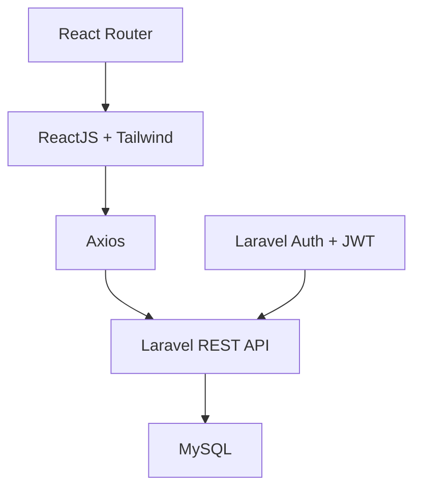

<div align="center">

# 🏨 La Maison DTN

### ✨ Luxury Hotel Management & Booking System

<p>
Nền tảng đặt phòng & quản lý khách sạn 5★ phong cách châu Âu tại Việt Nam
</p>


</div>

---

## 📌 Overview

**La Maison DTN** là hệ thống quản lý và đặt phòng khách sạn cao cấp, được xây dựng nhằm mang lại trải nghiệm đặt phòng mượt mà, hiện đại và trực quan.

🔹 Thiết kế hướng đến **UX/UI luxury**
🔹 Tối ưu cho **khách sạn 5 sao**
🔹 Kiến trúc tách biệt **Frontend – Backend (REST API)**

---

## ✨ Features

### 👤 Customer

| Tính năng             | Mô tả                       |
| --------------------- | --------------------------- |
| 🔐 Authentication     | Đăng ký / đăng nhập với JWT |
| 🗺 Room Map           | Xem phòng trực quan         |
| ⚡ Quick Booking       | Đặt phòng nhanh             |
| 📅 Booking Management | Quản lý & lịch sử đặt phòng |
| 📄 Export             | Tải file booking            |
| 👤 Profile            | Quản lý thông tin cá nhân   |

---

### 🛠 Admin

| Tính năng              | Mô tả               |
| ---------------------- | ------------------- |
| 🏨 Room Management     | Quản lý phòng & giá |
| 📊 Dashboard           | Thống kê hệ thống   |
| 👥 Customer Management | Quản lý khách hàng  |
| 💰 Revenue Reports     | Báo cáo doanh thu   |

---

## 🧱 Tech Stack

### 🔹 Architecture



### 🔹 Frontend

```
React 18+, React Router, Axios, TailwindCSS, Lucide Icons
```

### 🔹 Backend

```
Laravel 10+, REST API, JWT Auth, MySQL, Eloquent ORM
```

---

## 🚀 Getting Started

### ⚙️ Prerequisites

```
Node.js >= 18
PHP >= 8.1
Composer
MySQL >= 8.0
```

---

### 🔧 Backend Setup

```bash
cd backend
composer install
cp .env.example .env
php artisan key:generate
php artisan migrate --seed
php artisan serve
```

---

### 🌐 Frontend Setup

```bash
cd frontend
npm install
npm run dev
```

---

## 📡 API Endpoints

```yaml
/auth:
  POST /login
  POST /register

/rooms:
  GET /rooms
  GET /rooms/{id}

/bookings:
  POST /bookings
  GET /bookings
  GET /bookings/{id}
```

---

## 🤝 Contributing

```bash
# Clone project
git clone your-fork-url
cd la-maison-dtn

# Install dependencies
npm install
composer install

# Run project
npm run dev
php artisan serve
```

### Workflow

* Fork repository
* Create feature branch
* Commit changes
* Push & Create Pull Request

---

## 📄 License

MIT License

---

## 👨‍💻 Contact

* 👤 Developer: **Đỗ Thành Nhân**
* 📧 Email: **[dothanhnhan1024@gmail.com](mailto:dothanhnhan1024@gmail.com)**
* 🌐 Demo: https://hotel-booking-umber-one.vercel.app/
* 📱 Hotline: +84 386 356 750

---

<div align="center">

⭐ **If you find this project useful, give it a star!** ⭐

</div>
